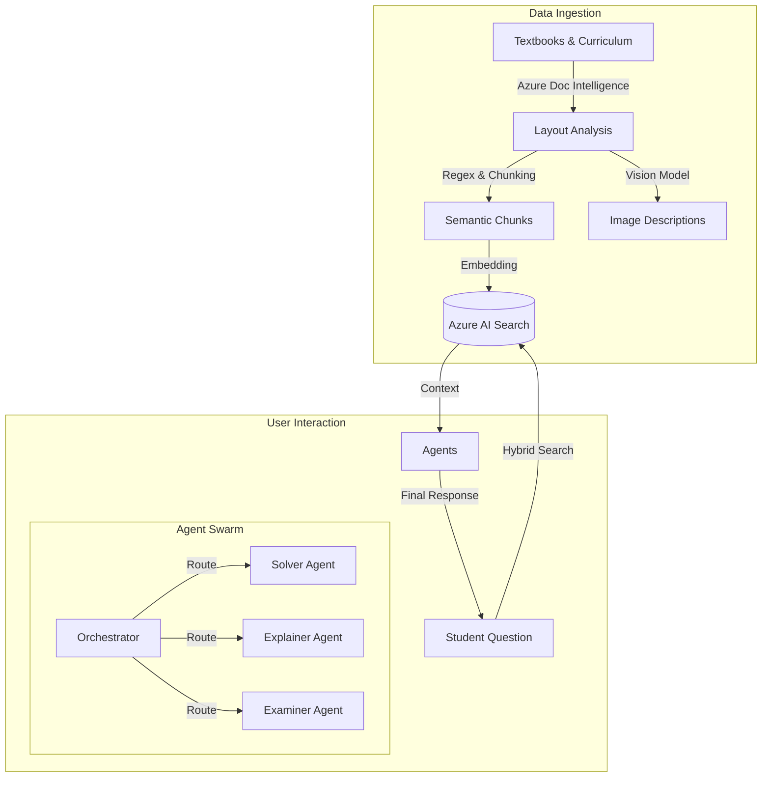

# 🎓 Meba - MEB RAG System

> **Next-Generation AI Tutor for the Turkish National Education Curriculum**  
> *Powered by Azure OpenAI, RAG, and Agentic Workflows*


---

## 📖 Overview

**Meba** is an advanced AI-powered educational platform designed to provide personalized tutoring conformant with the **Turkish Ministry of National Education (MEB)** curriculum. Unlike standard LLMs, Meba doesn't just "guess" answers; it strictly adheres to official textbooks and learning objectives (*Kazanımlar*).

It uses a **RAG (Retrieval-Augmented Generation)** architecture to ground its responses in reliable sources and employs **Agentic Workflows** to act as a teacher, exam creator, and guidance counselor.

## ✨ Key Features

### 📚 Hyper-Localized Knowledge Base
- **Deep PDF Processing:** Ingests official MEB Textbooks and Curriculum Guides using **Azure Document Intelligence**.
- **Hybrid Search:** Combines semantic vector search (understanding meaning) with keyword search (understanding terminology) for 99% retrieval accuracy.
- **Space-Tolerant Parsing:** Custom regex algorithms designed to parse the complex "Maarif Modeli" curriculum codes (e.g., `BİY.11.2.1`).

### 🧠 Cognitive Diagnostic Engine
- **Synthetic Question Generation:** Automatically generates thousands of practice questions for *each* learning objective using GPT-4o.
- **Reverse Engineering:** When a student asks about an unknown question, Meba identifies exactly which curriculum objective is being tested.
- **Gap Analysis:** Pinpoints the exact "root cause" of a student's mistake (e.g., "You missed this question not because you don't know Physics, but because you forgot how to solve Quadratic Equations").

### 🤖 Agentic Architecture (LangGraph)
- **Concept Explainer Agent:** Teaches topics using textbook analogies.
- **Question Solver Agent:** Solves problems step-by-step.
- **Exam Creator Agent:** Builds personalized mock exams.
- **Guidance Agent (Rehberlik):** Tracks progress and offering study advice.

---

## 🏗️ Architecture



## 🛠️ Tech Stack

- **Core:** Python 3.11, Pydantic
- **AI & LLM:** Azure OpenAI (GPT-4o, Text-Embedding-3-Large)
- **Vector Store:** Azure AI Search (Indexers, Semantic Ranker)
- **Orchestration:** LangGraph (State management), LangChain
- **Infrastructure:** Docker, Docker Compose
- **Database:** PostgreSQL (User data, conversation history)

---

## 🚀 Getting Started

### Prerequisites
- **Docker Desktop** installed an running.
- An **Azure Subscription** with OpenAI and AI Search resources enabled.

### Installation

1. **Clone the repository**
   ```bash
   git clone https://github.com/ikoshos-gland/Mebas.git
   cd Mebas
   ```

2. **Configure Environment**
   Create a `.env` file in the root directory:
   ```ini
   AZURE_OPENAI_API_KEY=your_key
   AZURE_OPENAI_ENDPOINT=https://your-resource.openai.azure.com/
   AZURE_OPENAI_API_VERSION=2024-12-01-preview
   AZURE_SEARCH_ENDPOINT=https://your-search.search.windows.net
   AZURE_SEARCH_API_KEY=your_search_key
   DOCUMENTINTELLIGENCE_ENDPOINT=https://your-doc-intel.cognitiveservices.azure.com/
   DOCUMENTINTELLIGENCE_API_KEY=your_doc_key
   ```

3. **Build & Run with Docker**
   ```bash
   docker compose up --build
   ```

4. **Ingest Data (First Run)**
   Put your PDFs in `data/pdfs/` and run:
   ```bash
   docker compose run --rm api python scripts/process_pdfs.py
   ```

---

## 🤝 Contributing

This project is currently in the **Alpha** phase. Contributions are welcome!
1. Fork the repo.
2. Create a feature branch (`git checkout -b feature/AmazingFeature`).
3. Commit your changes (`git commit -m 'Add some AmazingFeature'`).
4. Push to the branch (`git push origin feature/AmazingFeature`).
5. Open a Pull Request.

---

## 📜 License

Distributed under the MIT License. See `LICENSE` for more information.
